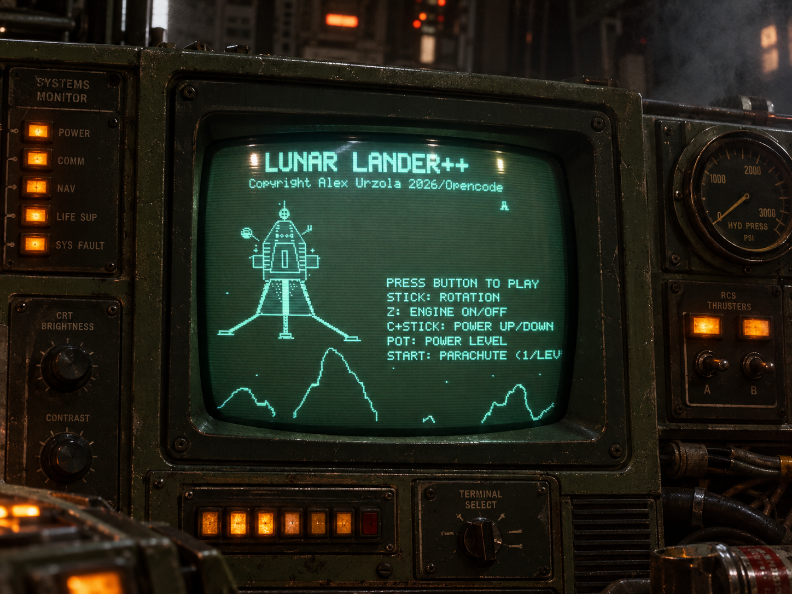

# Lunar Lander ESP32

A port of the game **moonlander.seb.ly** (JavaScript) to an **ESP32** with **composite
video (AV)** output to a **black & white CRT** with composite input (video + sound).

<video src="images/video.mp4" controls width="480"></video>



Arcade physical controls:

- **Wii Nunchuck** → direction (joystick X) and the engine trigger button.
- **Potentiometer** → engine power (thrust) level.
- **Button** → start / restart the game.

## Code

| Path | Content |
|------|---------|
| `esp32Lander/` | Std C++ port of the game (no hardware): physics, terrain, ship. Validated on PC (`make && ./test_pc`). |
| `esp32LanderS3/` | **Main B/W CRT version**: ESP32-S3 with composite video via LCD_CAM+GDMA (audio GPIO18, nunchuck I2C). |
| `esp32LanderVGA/` | Second ESP32 (WROOM-32) outputting the game over parallel VGA (SVGA 640x480@60, monochrome). |
| `esp32LanderComposite/` | (DISCONTINUED 24/8/2026) classic ESP32 sketch; kept as historical archive. |
| `sounds/` | Sound generation pipeline (`real_sounds.py`) + source WAVs. |

See `AGENTS.md` for the full technical documentation (physics, terrain, audio, decisions).
For the electrical detail (pinout, wiring, voltage divider, measurements, flash/partitions)
and the specialized hardware agent, see **`docs/hardware.md`**. ASCII wiring schematics for
each board (ESP32-S3, VGA, discontinued composite) live in **`docs/schematics.md`**.

## Pinout (main version: ESP32-S3)

| GPIO | Signal | Use |
|------|--------|-----|
| **GPIO21** | I2C SDA | Nunchuck data (Wii), 50 kHz, explicit internal pull-up. |
| **GPIO9** | I2C SCL | Nunchuck clock (Wii), 50 kHz, explicit internal pull-up. |
| **GPIO8** | ADC pot (thrust level) | Potentiometer → engine **power level** `0.0–1.0`. Disabled in-game (`POT_DISABLED=1`). |
| **GPIO13** | START button | Button to GND with `INPUT_PULLUP` (edge) → starts / restarts the game. **No autostart.** |
| **GPIO4, 5, 6, 7, 15, 16, 40, 41** | Composite video (LCD_CAM bus D0–D7) | Own LCD_CAM+GDMA driver, NTSC `320x240` B/W (~58.6 fps) → resistive DAC → RCA. |
| **GPIO18** | Audio | LEDC PWM 312.5 kHz @ 8-bit with APB clock (`ledcSetClockSource(LEDC_USE_APB_CLK)`) → external amp. |
| **3.3 V** | Sensor power | Nunchuck + pot end. |
| **GND** | Reference | Common ground for all circuits + TV RCA. |
| **USB** | Power + flash | Programming and serial monitor (115200 baud). |

> The historical composite pinout (GPIO21/22 nunchuck, GPIO34 pot, GPIO25 video DAC,
> GPIO26 audio) is kept in `docs/hardware.md` as reference for the discontinued board.

### Pin notes

- **GPIO8** on the S3 is an ADC-capable input for the pot.
- The video bus pins are the LCD_CAM data lines; the driver feeds them through a
  resistive DAC toward the RCA jack. Do not reuse them for other signals.
- Nunchuck: the cable has 6 pads: 3.3 V, GND, SDA, SCL (the other two are the
  accelerometer and are unused). Connected directly (3.3 V logic).

## Wiring

### Nunchuck → direction + trigger (GPIO21 / GPIO9)

```
3.3 V ──► nunchuck VCC
GND  ──► nunchuck GND
GPIO21 ──► nunchuck SDA (internal pull-up)
GPIO9  ──► nunchuck SCL (internal pull-up)
```

- Joystick X → ship angle; **Z** button → engine on/off (released = engine off).
- I2C 50 kHz, address `0x52`, optionally encrypted with key `0x17` (auto-detected).

### Potentiometer → power level (GPIO8)

```
3.3 V ──┬──[end 1]
        │
   [10 kΩ pot]
        │
      [wiper] ──► GPIO8
        │
   [end 2]
        │
 GND ───┴───
```

- Optional 0.1 µF cap from wiper to GND to clean noise.
- The pot only sets the power level; the engine is toggled with the nunchuck Z button.
- **Disabled in-game** (`POT_DISABLED=1`): power is set with **C + stick** instead.

### Video and audio → TV

```
GPIO4..41 (LCD_CAM bus) ── resistive DAC ──► RCA yellow (composite NTSC)
GPIO18 ──[1–10 µF]──► amp / RCA white (audio, series coupling)
GND   ───────────────► GND / TV ground
```

## Compile and flash

```sh
# Validate the port on PC (no hardware)
cd esp32Lander && make && ./test_pc

# Compile the main version (ESP32-S3, composite B/W CRT)
arduino-cli compile --fqbn esp32:esp32:esp32s3:PSRAM=opi esp32LanderS3/esp32LanderS3.ino

# Flash
arduino-cli upload --fqbn esp32:esp32:esp32s3:PSRAM=opi --port /dev/ttyACM0 esp32LanderS3/esp32LanderS3.ino
```

## Hardware schematic / pinout / connections

There is no formal EDA schematic file in this repo. The electrical reference lives in
**`docs/hardware.md`**, which documents:

- The full **pinout** of the main ESP32-S3 board and of the discontinued classic composite
  board and the VGA board (GPIO → signal table).
- **Wiring diagrams** for the nunchuck (I2C), the potentiometer (voltage divider to ADC),
  the video output (composite / VGA resistive DAC + DE-15 connector) and audio (series
  coupling cap → amp/RCA).
- **Measured values**: throttle rheostat resistance sweep (500→30 Ω), pot readings, VGA
  white-level math (270 Ω/leg → 0.717 V), RC filter proposals.
- **Flash / partition** details (`no_ota` layout) and memory usage.

The VGA board architecture has its own doc: `docs/PLAN_VGA.md`.