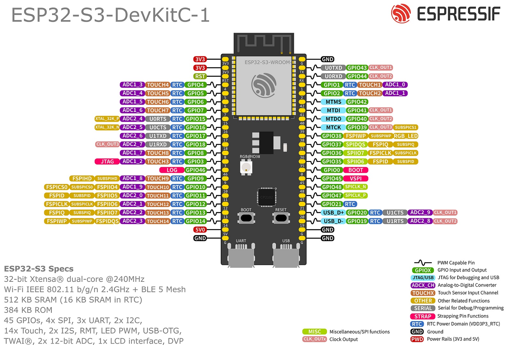

# Lunar Lander ESP32 — Hardware / Cableado / Pinado

> **ESTADO (29/9/2026)**: la versión principal para CRT B/N es el **ESP32-S3**
> (`esp32LanderS3/`, video compuesto por LCD_CAM+GDMA). El board clásico
> (`esp32LanderComposite/`) **ya no se puede usar** (placa dada de baja); su pinout
> histórico se ha eliminado de este documento. El board VGA (`esp32LanderVGA/`) sigue
> activo como segundo ESP32.

> Documento de referencia para hardware. **No se carga en el contexto del agente principal**
> durante el desarrollo normal de código (juego, física, render, UI). Lo usa el
> `hardware` agent (ver `.opencode/agent/hardware.md`) cuando se trabaja en electricidad,
> cableado, mediciones o pinout.

## Pinout del ESP32-S3 (VERSIÓN PRINCIPAL, `esp32LanderS3/`)



> Esquemáticos ASCII de conexiones de las tres placas: **`docs/schematics.md`**.

| Señal | GPIO | Notas |
|-------|------|-------|
| I2C nunchuck SDA | GPIO21 | 50 kHz, pull-ups internos vía `gpio_set_pull_mode`, dirección 0x52 |
| I2C nunchuck SCL | GPIO9 | |
| Potenciómetro (nivel de potencia) | GPIO8 | ADC; deshabilitado en juego (`POT_DISABLED=1`) |
| Botón start | GPIO13 | `INPUT_PULLUP` |
| Video compuesto (bus LCD_CAM D0–D7) | GPIO4, 5, 6, 7, 15, 16, 40, 41 | driver propio LCD_CAM+GDMA, NTSC 320×240 B/N (~58.6 fps); DAC resistivo hacia RCA |
| Audio | GPIO18 | LEDC PWM 312.5 kHz @ 8-bit con reloj APB (`ledcSetClockSource(LEDC_USE_APB_CLK)`) → amp externo |

FQBN `esp32:esp32:esp32s3:PSRAM=opi`; el bgLayer (~638 KB) vive en PSRAM.

## Conexión del potenciómetro (pot → ADC)

```
3.3 V ──┬──[extremo 1]
        │
   [pot 10 kΩ]
        │
      [cursor] ──► ADC (GPIO8)
        │
   [extremo 2]
        │
 GND ───┴───
```

- Pin 1 (extremo) → 3.3 V; pin 2 (extremo) → GND; pin 3 (cursor/medio) → ADC.
- Reversible: si el ángulo sale invertido, se invierte en software o se cambian los extremos.
- Condensador opcional de 0.1 µF del cursor a GND para limpiar ruido.

## Salida de video (compuesta a CRT B/N)

- **Principal (ESP32-S3)**: driver propio **LCD_CAM + anillo GDMA** en
  `esp32LanderS3/src/video_s3.*`. NTSC 320×240 B/N sin costuras entre campos, ~58.6 fps en
  demo; bus de datos **GPIO4/5/6/7/15/16/40/41** → **DAC resistivo** → RCA amarillo del CRT.
  La red de resistencias (R-2R o resistencias ponderadas + terminación 75 Ω) no está
  documentada en el código → ver `docs/schematics.md` (§1.5) y `[ver video_s3.cpp]`.
  El renderer escribe en el framebuffer del driver; el EOF del GDMA sincroniza el draw.
- El framebuffer (~76 KB) se aloja en el driver.

## Salida de video VGA (segundo ESP32, rama `vga-out`)

Board aparte (WROOM-32, sin PSRAM) que saca el juego por **SVGA 640x480@60** monocromo.
El CRT compuesto queda intacto en su placa. Detalle de la arquitectura: `docs/PLAN_VGA.md`.

- **Driver**: `bitluni/ESP32Lib` (CC BY-SA 4.0) embebido en `src/esp32lib/`; fork de
  `VGA8BitDACI` con frame store externo (320x240, escalado 2x en el ISR de línea).
- **Pines del board VGA**:

| Señal | GPIO | Notas |
|-------|------|-------|
| Video (DAC) | GPIO25 | DAC1 → divisor 270Ω×3 en paralelo a R/G/B |
| HSYNC | GPIO32 | digital |
| VSYNC | GPIO33 | digital |
| I2C nunchuck SDA/SCL | GPIO21/GPIO22 | igual que la S3 (nunchuck) |
| Pot / Botón start / Audio | GPIO34 / GPIO13 / GPIO26 | |

- **Circuito del conector VGA (DE-15)** — solo 7 pines:

```
GPIO25 ──[270Ω]──┬────────► VGA pin 1 (R)
GPIO25 ──[270Ω]─┤────────► VGA pin 2 (G)
GPIO25 ──[270Ω]─┴────────► VGA pin 3 (B)
GPIO32 ────────────────────► VGA pin 13 (HSYNC)
GPIO33 ────────────────────► VGA pin 14 (VSYNC)
GND ───────────────────────► VGA pines 5/6/7/8/10
```

Las resistencias + los 75 Ω de terminación interna del monitor forman el divisor de voltaje
(mismo voltaje a los tres colores → gris, `voltageDivider=true` en `init()`). El **270 Ω/rama**
da `V_blanco = 3.3·75/(270+75) = 0.717 V` (spec VGA 0.7 V) y `V_negro = 0 V`; ~9.6 mA por rama
(~29 mA total). **Importante**: usar las MISMAS resistencias en las tres ramas — el circuito
`100/100/220` del ejemplo de bitluni es para **dos DACs** (GPIO25→R/G, GPIO26→B); con un solo
DAC da 1.414 V en R/G (recorte, "blanco" saturado) y tinte por desbalance. Alternativas:
280 Ω (0.697 V, exacto) o 330 Ω (0.611 V, con margen de corriente). GPIO32/33 son XTAL_32K_P/N
en algunos DevKit — verificar que la placa no tenga el cristal de 32 kHz montado. No conectar
el pin 9 (+5 V) ni los DDC (4/11/12/15); sync directo a 13/14 (TTL, sin terminación).
- **Memoria**: no caben dos buffers de 76.8 KB en DRAM estática → `fbBack` es estático y
  `fbFront` (el que lee el ISR) se `malloc`ea al inicio de `setup()` (heap ~216 KB libres).
- **Test antes del juego**: `#define VGA_TEST_PATTERN 1` dibuja rampa de grises + rejilla +
  marco; verificado, pasar a `0`.

## Sonido — cableado

- **S3 (principal)**: **GPIO18 → condensador de acople en serie (1–10 µF) → RCA blanco del TV**
  (quita el DC; lógica de 3.3 V). Vía: **PWM por LEDC + timer ISR** (canal 0) con
  `ledcSetClockSource(LEDC_USE_APB_CLK)` → 312.5 kHz @ 8-bit (quirks de duty en WORKLOG #53).
  Verificado con parlante + amplificador.
- **Board VGA**: **GPIO26** con el mismo circuito de acople (cap 1–10 µF → amp / RCA blanco).
- Datos de audio y pipeline de generación: ver `sounds/` (no es hardware).

## Amplificador tentativo para Video Monitor Monocromo (PENDIENTE, 16/8/2026)

Módulo amplificador de audio mono de pequeña potencia basado en **XPT8871** (SOP-8, ESOP).
El objetivo: amplificar la salida de audio del ESP32 (GPIO18 en la S3 / GPIO26 en la VGA) para
que el sonido se oiga por un parlante junto al monitor monocromo (el TV/CRT por su entrada RCA
ya no sería la única vía).

**Estado: NUNCA SONÓ.** Aún no se sabe si el módulo está defectuoso (algo desconectado por
dentro), si le falta el circuito amplificador previo (filtro del portador PWM), o si el módulo
no sirve para esta señal. Queda como pendiente de revisión/prueba.

### Datos del módulo (por inspección)

- Integrado: **XPT8871** (línea inferior `HL33491`), clase **AB/D seleccionable** (pin MODE).
- Pasivos: MLCC C1/C2/C3 (entrada/filtrado), electrolítico SMD 220 µF 16 V (filtro de
  alimentación), R3 serigrafía **101 = 100 Ω** (serie de entrada).
- Specs del integrado (datasheet): 3 W @ 4 Ω @ 5 V, alimentación 2.5–5.5 V, **impedancia de
  entrada ~15 kΩ**, ancho de banda de ganancia ~2.5 MHz (entrada `-IN` invertida, pin 4).

### Cadena actual (NO verificada)

```
GPIO18 ──[1–10 µF acople]── IN del módulo XPT8871 ── parlante
```

### Hipótesis a revisar (en orden)

1. **Módulo defectuoso / frío**: revisar soldaduras del módulo (sobre todo pin `-IN`, `SD` y
   `MODE`), alimentación y GND. Con multímetro: verificar continuidad y que `VDD` reciba
   voltaje real al encender.
2. **Falta el circuito amplificador previo (filtro RC)**: la salida del LEDC es PWM cuadrado
   a **312.5 kHz**; el XPT8871 deja pasar ese portador (BW ~2.5 MHz) y su modulador clase D se
   intermodula → salida baja/opaca ("apagado"). El TV lo toleraba por su banda limitada (~15 kHz).
   **Filtro propuesto de 2 polos** (corte ~16 kHz/etapa, ~-52 dB @ 312.5 kHz):

   ```
   GPIO18 ──[1 µF]──┬──[1 kΩ]──┬──[1 kΩ]──┬── IN del módulo XPT8871
                   │          │          │
                  [10 nF]    [10 nF]    (R3 interno 100 Ω → integrado)
                   │          │          │
                  GND        GND        GND
   ```

   No quitar el condensador de acople: bloquea el DC de ~1.65 V del PWM (sin él el offset
   entra a `-IN` y corrompe la polarización).
3. **Alimentación**: dar **5 V externos** al módulo (GND común con el ESP32); con 3.3 V del
   ESP32 la potencia cae a ~1 W y los picos del parlante pueden causar brownouts.
4. **Quizá se necesite otro amplificador** (p.ej. de entrada de línea o con mayor ganancia) si
   con 1–3 resuelto el módulo sigue sin sonar.

### Pruebas pendientes

- [ ] Inspección visual/soldaduras del módulo + continuidad.
- [ ] Probar la salida de audio → cap → filtro RC de 2 polos → módulo → parlante.
- [ ] Medir AC (mV) en el nodo de entrada del módulo con el motor encendido (deberían verse
      cientos de mV de señal limpia, sin el cuadrado de 312.5 kHz).
- [ ] Alimentar el módulo con 5 V externo (GND común) y repetir.
- [ ] Si nada de lo anterior: probar otro módulo/parlante para descartar el XPT8871.
- [ ] Documentar aquí el circuito final una vez que suene.

## Flash / memoria (resumen)

- **S3 (principal)**: flash ~643 KB (49 % del app slot de 1.3 MB), RAM estática ~211 KB (64 %),
  FQBN `esp32:esp32:esp32s3:PSRAM=opi`; el bgLayer (~638 KB) vive en PSRAM.
- **Board VGA**: compila con esquema `no_ota` (2 MB app), sketch ≈ 552 KB (42 %), RAM 112 KB
  (34 %), heap ~216 KB (de los que 76.8 KB van al `fbFront`).